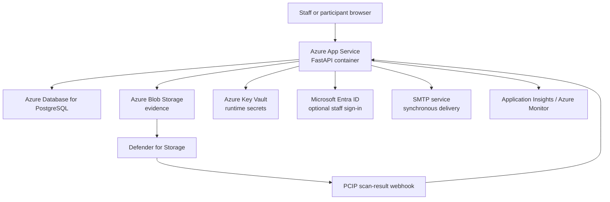
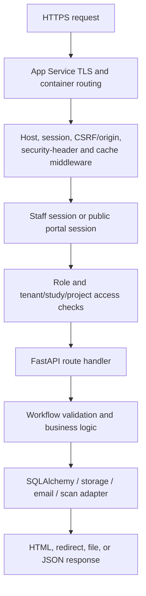
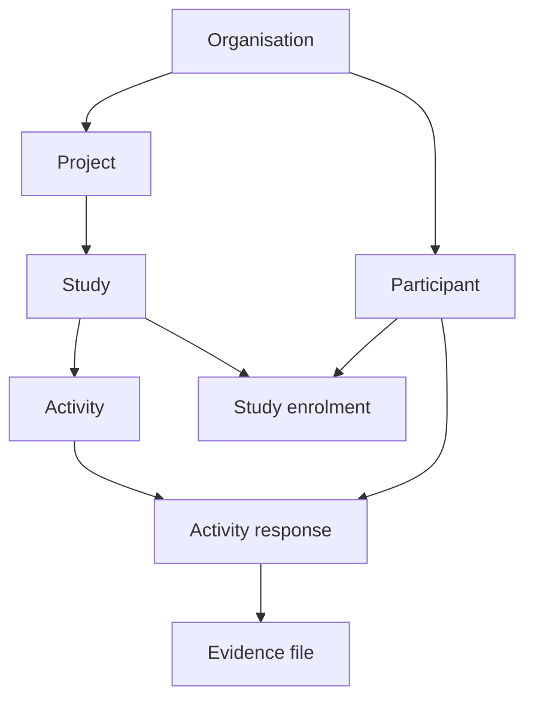

# PCIP Architecture

Last verified from the repository: 2026-07-28

## Scope and evidence

This document describes the code in this repository. It does not claim that the
live Azure environment matches the Bicep template or the GitHub workflow. Live
inventory on 2026-07-28 verified selected Web App, ACR, app-setting, and
PostgreSQL state. Database revision, source-commit provenance, exact
running-container digest correlation, scale details, logs, alerts, and restore
evidence remain unknown.

## System summary

PCIP is a server-rendered FastAPI monolith. It provides staff workflows for
projects, studies, participant management, evidence, research access, audit,
privacy, and email outbox administration, plus a separate token-based
participant portal. PostgreSQL is the hosted database. SQLite remains available
for development and tests.

The production design represented by the repository is:

## Repository layout and responsibilities

| Path | Responsibility |
|---|---|
| `app/main.py` | FastAPI construction, middleware, startup, route handlers, access checks, participant portal, privacy workflows, health endpoints, and most business logic |
| `app/config.py` | Environment-backed Pydantic settings, Key Vault overrides, and hosted-environment safety validation |
| `app/db.py` | SQLAlchemy engine, declarative base, session factory, and request-scoped session dependency |
| `app/models.py` | SQLAlchemy ORM entities and database constraints |
| `app/security.py` | Password hashing, random tokens, token hashing, and signed staff sessions |
| `app/csrf.py` | CSRF token creation and state-changing request validation |
| `app/entra.py` | Authlib OpenID Connect client configuration for Microsoft Entra ID |
| `app/storage.py` | Local and Azure Blob storage adapters |
| `app/scanner.py` | Local/ClamAV malware scan adapter |
| `app/services.py` | Audit event creation and the database-backed email outbox with synchronous SMTP attempt |
| `app/observability.py` | Azure Monitor OpenTelemetry bootstrap |
| `app/templates/` | Jinja2 server-rendered staff and participant views |
| `app/static/` | CSS, browser JavaScript, and brand assets |
| `migrations/` | Alembic revisions `0001` through `0006` |
| `infra/main.bicep` | Azure resources, identities, role assignments, app settings, and secret references |
| `.github/workflows/ci.yml` | Unit/integration tests, PostgreSQL migration check, dependency/security checks, and container smoke test |
| `.github/workflows/deploy-azure.yml` | Manually dispatched Azure infrastructure and container deployment |
| `entrypoint.sh` | Optional Alembic upgrade followed by Uvicorn |
| `Dockerfile` | Python 3.12 release image built from the locked runtime dependency set |
| `tests/test_app.py` | Application, authorization, security, privacy, migration-contract, and configuration tests |

## Package and dependency structure

`app.main` is the composition root. Importing it loads configuration, constructs
the database engine and storage backend, configures observability, builds the
FastAPI application, and registers routes. Route handlers call SQLAlchemy
directly and use small helpers from `security`, `services`, `scanner`, and
`storage`.

There is no separate domain or repository layer. This is simple to follow at the
current size, but it makes `app/main.py` the principal coupling and change-risk
hotspot. A future extraction should be incremental and based on cohesive
workflows, not a framework-wide rewrite.

Patterns present in the code:

- dependency injection through FastAPI dependencies for database sessions,
  CSRF, current user, and role checks;
- adapter/protocol boundary for evidence storage;
- a global staff identity with role-bearing organisation memberships, while
  tenant-owned domain records retain explicit organisation IDs;
- server-side rendered MVC-like request handling;
- hashed one-time staff/password tokens and reusable, revocable participant
  links, all exchanged for short opaque browser sessions;
- database outbox record combined with an immediate SMTP delivery attempt;
- infrastructure as code using Bicep and managed identities.

## Request lifecycle

### Container and application startup

1. Azure App Service pulls the configured private ACR image using the app's
   system-assigned managed identity.
2. The container executes `/app/entrypoint.sh`.
3. When `RUN_MIGRATIONS=true`, the entrypoint runs `alembic upgrade head`.
4. The entrypoint replaces itself with
   `uvicorn app.main:app --host 0.0.0.0 --port "${PORT:-8000}"`.
5. Module import loads settings and optional Key Vault overrides, creates the
   SQLAlchemy engine and storage adapter, configures Azure Monitor when a
   connection string exists, and constructs FastAPI.
6. FastAPI lifespan startup configures logging, validates hosted settings,
   verifies database connectivity and Alembic head, verifies storage readiness,
   and runs SQLAlchemy `create_all`.
7. SQLite-only compatibility alterations and optional demo seeding run after
   that validation. The Bicep template disables demo seeding.
8. `/health/ready` reports ready only when a database query succeeds. App
   Service uses this endpoint as its health check.

### HTTP request

Staff authentication uses a signed `session` cookie containing a user ID and
`session_version`. The user must still be active and the version must match the
database, which allows password resets and administrative actions to invalidate
existing sessions. Local password login and optional Entra OIDC login converge
on this model.

Participant, password-reset, and researcher-invitation links are not retained in
the browser URL after initial use. A hashed one-time token is exchanged for a
hashed, revocable `PublicAuthSession` represented by an HttpOnly cookie.

State-changing browser requests are protected by CSRF and origin validation.
Staff authorization is enforced by role dependencies plus organisation,
project, and study checks. Researchers see studies they created or were
explicitly granted access to; owners and administrators manage the organisation.

## Data model

The core ownership chain is:

Supporting entities provide study access, participant/staff invitations, public
token exchanges and sessions, password resets, messages, audit events, and
outbox emails.

Tenant isolation is primarily application-enforced with `organisation_id`
predicates. PostgreSQL row-level security is not implemented. Database foreign
keys and per-organisation uniqueness constraints provide additional integrity,
but they do not replace application authorization.

## Frontend

There is no independent frontend build. Jinja2 templates produce HTML, and
plain CSS/JavaScript in `app/static` adds interaction and presentation.
Consequently, there is no Node package manager, bundler, or frontend dependency
lock file.

## Configuration

Pydantic Settings loads process environment variables and `.env`. Direct
environment variables take precedence. If `KEY_VAULT_URL` is configured,
`DefaultAzureCredential` retrieves selected secrets only when the corresponding
direct environment variable is absent.

Hosted startup rejects weak/default session secrets, insecure cookies, HTTP or
wildcard public origins, local hosts, SQLite, missing Defender webhook secret,
incomplete Blob configuration, incomplete Entra configuration, and invalid Key
Vault URLs. The authoritative variable catalogue remains
`ENVIRONMENT_VARIABLES.md`.

## Known architectural boundaries

- One Uvicorn process is started per container; no explicit worker count is
  configured.
- The in-memory rate limiter is thread-safe and bounded within one process but
  is not shared between containers or instances.
- SMTP runs in the request process and can add up to its configured timeout to a
  request. There is no independent outbox worker.
- Alembic is the intended schema authority, but `Base.metadata.create_all` and a
  SQLite compatibility shim still run during application startup.
- Evidence metadata and blob writes are not one atomic transaction. The request
  path performs compensating deletion on handled scan/database failures, but a
  separate reconciliation process is still required for process termination or
  external inconsistency.
- Application routing and business logic remain concentrated in `app/main.py`.

These boundaries are tracked with priorities and remediation criteria in
`TECHNICAL_DEBT.md`.
